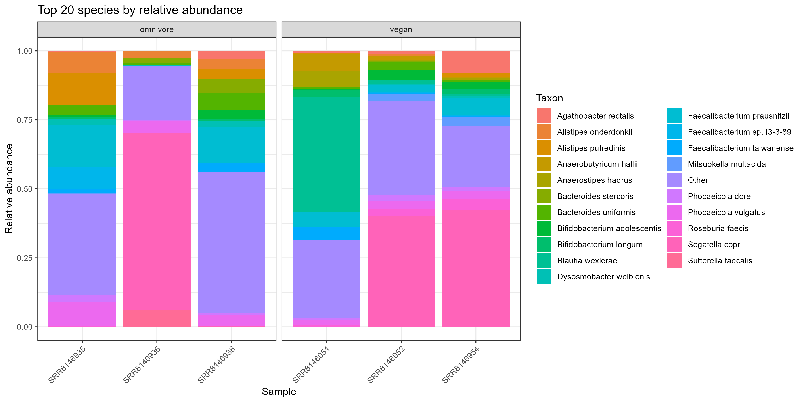

# Assignment 3

## Matei Dan-Dobre

### 1407506

# Introduction

The human gut microbiome is a highly diverse and dynamic microbial community that plays a critical role in host physiology, including metabolism, immune regulation, and disease susceptibility (Lynch & Pedersen, 2016). Growing evidence has demonstrated that the composition and function of the gut microbiome are strongly influenced by environmental factors, among which diet is one of the most significant modulators (Sonnenburg & Bäckhed, 2016).

Both short-term dietary interventions and long-term dietary patterns have been shown to alter gut microbial communities. For example, rapid shifts in diet can lead to measurable changes in microbiome composition within days, highlighting the responsiveness of the microbiome to dietary inputs (David et al., 2014). Over longer timescales, habitual dietary patterns such as vegan and omnivorous diets have been associated with distinct microbial signatures. Diets rich in plant-based foods tend to promote the growth of fiber-degrading and short-chain fatty acid–producing taxa, whereas diets higher in animal-derived products are associated with different microbial profiles and metabolic outputs (De Filippis et al., 2019).

Advances in sequencing technologies, particularly shotgun metagenomics, have enabled detailed characterization of microbial communities at high taxonomic resolution. Unlike amplicon-based approaches, shotgun metagenomics allows for species-level identification and functional inference. Tools such as Kraken2 and Bracken have facilitated this process by providing rapid and accurate taxonomic classification and abundance estimation from sequencing reads (Wood et al., 2019; Lu et al., 2017).

Despite these advances, identifying consistent diet-associated differences in the gut microbiome remains challenging due to substantial inter-individual variability and limitations in sample size across studies. While some studies report clear distinctions between dietary groups, others find that individual variation can obscure broader patterns, particularly in smaller cohorts (Lynch & Pedersen, 2016; Sonnenburg & Bäckhed, 2016). This highlights the importance of applying robust analytical pipelines and cautious interpretation when examining microbiome data.

In this context, the present analysis examines publicly available shotgun metagenomic data from the SRA project SRP126540 to explore differences in gut microbiome composition between vegan and omnivorous individuals. By integrating taxonomic classification, diversity analyses, and differential abundance testing, this analysis aims to evaluate whether dietary patterns are associated with detectable differences in microbial communities within a small sample set.

# Methods

Shotgun metagenomic sequencing data were obtained from the NCBI Sequence Read Archive (SRA) under project accession SRP126540, associated with the study by De Filippis et al. (2019). Six samples were selected for analysis, consisting of three vegan and three omnivore gut microbiome samples. Raw sequencing reads were downloaded using the SRA Toolkit (fasterq-dump) and processed as paired-end FASTQ files. Data retrieval was automated using a Bash script [download_data.sh](scripts/download_data.sh) to ensure reproducibility.

Taxonomic classification of sequencing reads was performed using Kraken2 (Wood et al., 2019) with a pre-built standard reference database (~8 GB). Kraken2 assigns taxonomic labels to sequencing reads by matching k-mers to a reference database. For each sample, paired-end reads were classified using multithreading, and classification reports were generated for downstream analysis. This step was executed using a custom script [run_kraken2.sh](scripts/run_kraken2.sh).

Species-level abundance estimation was performed using Bracken (Lu et al., 2017), which refines Kraken2 classifications by re-estimating taxon abundances based on k-mer distributions. Bracken was applied to Kraken2 output reports using a read length of 150 bp and species-level classification. This step produced corrected abundance estimates for each taxon in each sample and was automated using the script [run_bracken](scripts/run_bracken.sh).

All downstream analyses were conducted in R (version 4.5.2). Bracken output files were imported and combined into a single abundance matrix, where rows corresponded to taxa and columns corresponded to samples. A sample metadata table was constructed to indicate dietary group (vegan or omnivore) for each sample. A phyloseq object was then created to facilitate analysis and visualization (McMurdie & Holmes, 2013). These steps were implemented in an R script [analysis.R](scripts/analysis.R).

Relative abundance data were calculated by normalizing counts within each sample. Taxonomic composition was visualized using stacked bar plots of the most abundant taxa. Alpha diversity was assessed using Shannon and Simpson diversity indices, and differences between dietary groups were evaluated using the Wilcoxon rank-sum test.

Beta diversity was assessed using Bray–Curtis dissimilarity, followed by principal coordinates analysis (PCoA) to visualize differences in community composition between samples. Statistical significance of group differences was evaluated using permutational multivariate analysis of variance (PERMANOVA) implemented via the adonis2 function in the vegan package (Oksanen et al., 2020).

Differential abundance analysis was performed using ANCOMBC2 (Lin & Peddada, 2020), which accounts for compositional bias in microbiome data. The model tested for differences in taxon abundance between vegan and omnivore groups, with p-values adjusted using the Benjamini–Hochberg method. Sensitivity analysis was enabled to assess the robustness of detected differences.

# Results

## Taxonomic Composition

The relative abundance of microbial taxa varied substantially across samples, with several dominant species observed within individual microbiomes (Figure 1). Across both dietary groups, taxa such as Segatella copri and Faecalibacterium prausnitzii were among the most abundant species. Considerable inter-individual variation was observed, with some samples dominated by a single taxon, while others exhibited a more even distribution of species. While differences in taxonomic composition between vegan and omnivore samples were visually apparent, no consistent pattern of dominance was observed across all samples within each dietary group.

### Figure 1. Relative abundance of the top 20 microbial species across samples.

Stacked bar plot showing the relative abundance of the most abundant species in each sample, based on Bracken-estimated species-level counts. Each bar represents a sample, and colors correspond to individual taxa. Samples are grouped by dietary category (vegan or omnivore). Substantial inter-individual variation is observed, with certain taxa dominating specific samples.

---

## Alpha Diversity

Alpha diversity was assessed using Shannon and Simpson diversity indices (Figure 2). Shannon diversity values ranged across samples, with omnivore samples exhibiting greater variability compared to vegan samples, which appeared more tightly clustered. Simpson diversity showed a similar pattern. However, statistical testing using the Wilcoxon rank-sum test indicated no significant difference in alpha diversity between vegan and omnivore groups for either Shannon (W = 6, p = 0.7) or Simpson (W = 6, p = 0.7) indices.

### Figure 2. Alpha diversity of gut microbiome samples by diet.

Boxplots showing Shannon (top) and Simpson (bottom) diversity indices for vegan and omnivore samples. Individual data points represent samples. No statistically significant differences in alpha diversity were observed between dietary groups (Wilcoxon rank-sum test, p = 0.7 for both metrics).

---

## Beta Diversity

Beta diversity analysis using Bray–Curtis dissimilarity and principal coordinates analysis (PCoA) revealed partial clustering of samples by diet (Figure 3). Some vegan and omnivore samples grouped together, suggesting potential differences in community composition. However, clustering was not consistent across all samples, and substantial overlap between dietary groups was observed. Permutational multivariate analysis of variance (PERMANOVA) indicated that diet explained approximately 21.6% of the variation in microbial community composition (R² = 0.216), but this effect was not statistically significant (p = 0.2).

### Figure 3. Principal coordinates analysis (PCoA) of Bray–Curtis dissimilarity.

Ordination plot showing differences in microbial community composition across samples. Each point represents a sample, colored by dietary group (vegan or omnivore). Partial clustering by diet is observed, although overlap between groups indicates substantial inter-individual variability.

---

## Differential Abundance Analysis

Differential abundance analysis was performed using ANCOMBC2 to identify taxa associated with dietary group (Figure 4). No taxa were found to be significantly differentially abundant between vegan and omnivore samples after correction for multiple testing and sensitivity analysis. Although some taxa exhibited differences in estimated abundance between groups, none met the threshold for statistical significance.

### Figure 4. Differential abundance analysis of microbial taxa using ANCOMBC2.

Volcano plot showing log fold change (vegan vs. omnivore) versus statistical significance (-log10 q-value) for each taxon. The dashed line indicates the significance threshold (q = 0.05). No taxa were identified as significantly differentially abundant after multiple testing correction and sensitivity analysis.

---

# Discussion

This study examined differences in gut microbiome composition between vegan and omnivorous individuals using shotgun metagenomic data. While visual differences in taxonomic composition were observed, statistical analyses did not detect significant differences in alpha diversity, beta diversity, or differential abundance between dietary groups. These findings highlight the complexity of diet–microbiome relationships and the influence of inter-individual variability.

The relative abundance analysis demonstrated that certain taxa, including Segatella copri and Faecalibacterium prausnitzii, were prominent across samples. These taxa have been commonly reported in human gut microbiomes and are associated with carbohydrate metabolism and short-chain fatty acid production (De Filippis et al., 2019). However, the dominance of specific taxa varied widely between individuals, reflecting the well-established heterogeneity of the gut microbiome (Lynch & Pedersen, 2016).

Alpha diversity analyses using Shannon and Simpson indices revealed no significant differences between vegan and omnivore groups. Although omnivore samples exhibited greater variability in diversity values, this difference was not statistically significant. Previous studies have reported mixed results regarding the relationship between diet and alpha diversity, with some observing increased diversity in plant-based diets and others finding no consistent pattern (David et al., 2014; Sonnenburg & Bäckhed, 2016). The lack of significant differences in this study may reflect both biological variability and limited statistical power.

Beta diversity analysis indicated partial clustering of samples by diet, suggesting that dietary patterns may influence overall community composition. However, this clustering was not consistent across all samples, and PERMANOVA results were not statistically significant (p = 0.2). Despite the lack of significance, the observed effect size (R² = 0.216) suggests that diet may explain a moderate proportion of variation in microbial composition. This aligns with previous findings that diet contributes to microbiome variation, but is often secondary to individual-specific factors (Lynch & Pedersen, 2016).

Differential abundance analysis using ANCOMBC2 did not identify any taxa that were significantly associated with dietary group after multiple testing correction and sensitivity analysis. While some taxa exhibited nominal differences in abundance, none remained significant after adjustment. This result is consistent with the challenges of detecting robust differential signals in small cohorts, where high inter-individual variability can obscure diet-associated effects.

Several limitations of this study should be considered. Most notably, the small sample size (n = 3 per group) substantially reduces statistical power and limits the ability to detect significant differences. Additionally, microbiome data are inherently compositional and highly variable, further complicating statistical inference. The use of species-level resolution may also introduce noise, as closely related taxa can exhibit subtle abundance differences that are difficult to detect reliably.

Overall, the results suggest that while diet may influence gut microbiome composition, these effects are not readily detectable in small sample sets due to high variability between individuals. These findings are consistent with the broader literature, which emphasizes the need for larger sample sizes and careful statistical analysis to robustly identify diet-associated microbiome patterns. Future studies with increased sample size and additional metadata may provide greater insight into the relationship between diet and microbial community structure.

# References

David, L. A., Maurice, C. F., Carmody, R. N., Gootenberg, D. B., Button, J. E., Wolfe, B. E., Ling, A. V., Devlin, A. S., Varma, Y., Fischbach, M. A., Biddinger, S. B., Dutton, R. J., & Turnbaugh, P. J. (2014). Diet rapidly and reproducibly alters the human gut microbiome. Nature, 505(7484), 559–563. 

De Filippis, F., Pellegrini, N., Vannini, L., Jeffery, I. B., La Storia, A., Laghi, L., Serrazanetti, D. I., Di Cagno, R., Ferrocino, I., Lazzi, C., Turroni, S., Cocolin, L., Brigidi, P., Neviani, E., Gobbetti, M., O’Toole, P. W., & Ercolini, D. (2019). High-level adherence to a Mediterranean diet beneficially impacts the gut microbiota and associated metabolome. Cell Host & Microbe, 25(1), 1–12.

Lin, H., & Peddada, S. D. (2020). Analysis of compositions of microbiomes with bias correction. Nature Communications, 11(1), 3514. 

Lu, J., Breitwieser, F. P., Thielen, P., & Salzberg, S. L. (2017). Bracken: Estimating species abundance in metagenomics data. PeerJ Computer Science, 3, e104. 

Lynch, S. V., & Pedersen, O. (2016). The human intestinal microbiome in health and disease. New England Journal of Medicine, 375(24), 2369–2379. 

McMurdie, P. J., & Holmes, S. (2013). phyloseq: An R package for reproducible interactive analysis and graphics of microbiome census data. PLoS ONE, 8(4), e61217. 

Oksanen, J., et al. (2020). vegan: Community ecology package. R package version 2.5-7.

Sonnenburg, J. L., & Bäckhed, F. (2016). Diet–microbiota interactions as moderators of human metabolism. Nature, 535(7610), 56–64. 

Wood, D. E., Lu, J., & Langmead, B. (2019). Improved metagenomic analysis with Kraken 2. Genome Biology, 20(1), 257. 

